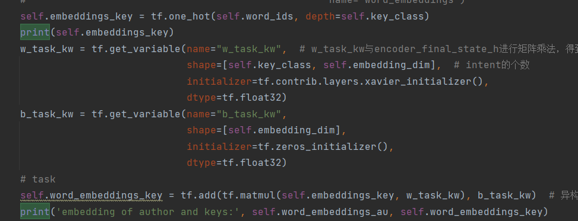
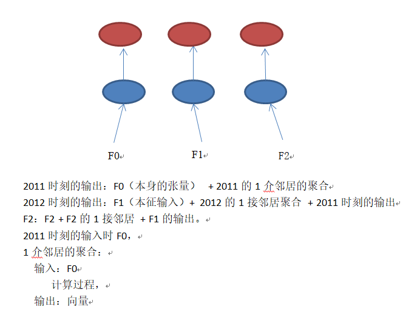
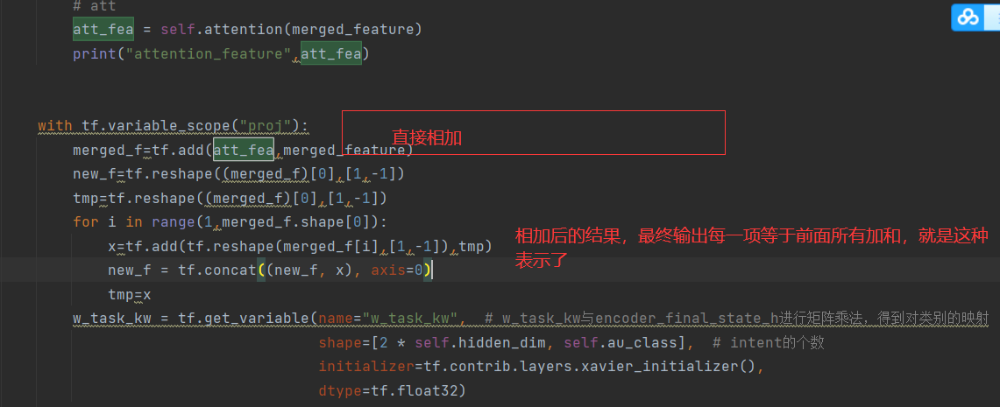
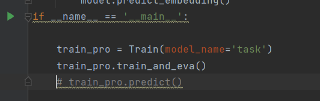
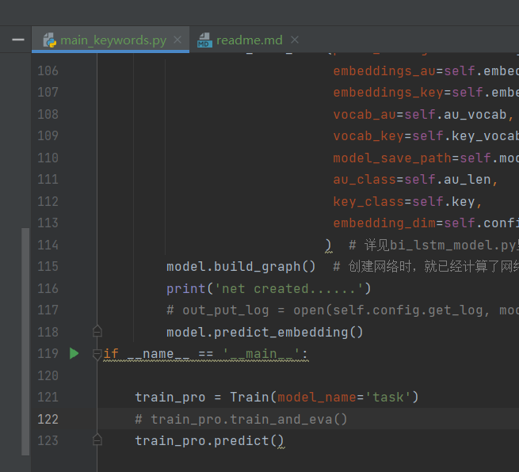
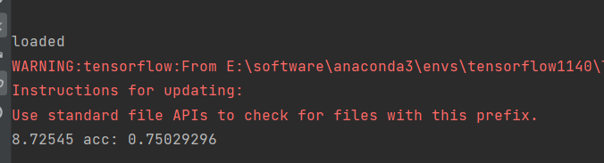

###对数据的预处理修改
>python DataProcess/dataread_csv.py

对同目录下的data_all.csv读取并预处理数据。

###对作者用关键词向量表示
对关键词使用onehot后，接入全连接层，再输入到bilstm中
在bi_lstm_model_att.py中lookup_layer_op函数：

### 对bilstm输出进行邻居聚合等

## 作者关键词和作者结构分别的向量提取
###1、关键词表示
训练过程使用下述命令
>python main_keywords.py

会提取作者关键词使用onehot表示，并接全连接层，加注意力聚合后根据合作作者提取作者关键词表示的向量。

将main_keywords.py中上图中的主函数改为如下就是进行预测作者关键词向量：

其中bi_lstm_model_keywords.py的Bi_LSTM_Task类的predict_embedding函数对所有作者关键词向量进行了预测，并且存入了
Source文件夹下的keyword.pkl.每个作者的关键词向量都是[1,200],以列表形式存储。

###2、机构表示
机构向量用类似的方法训练出
>python main.py

在预测所有作者的机构向量时，也是和上述一样的修改方式运行，然后在预测阶段，多存了所有的作者向量数量到Source文件下的
count_all.pkl，存了每个作者本应合作的作者到Source文件夹下label.pkl，而作者的机构向量表示在org.pkl中

##拼接机构向量和关键词向量
>python concat.py

将每个作者[1,200]的关键词向量和[1,200]的机构向量拼接起来[1,400]，以及存标签到label列，存到Source/data.pkl

##拼接向量输入到lstm中
>python lstm.py

##修改
将onehot步骤去掉，获得机构向量和关键词向量均达到80%以上准确率，送入lstm后准确率达到了75.03%

